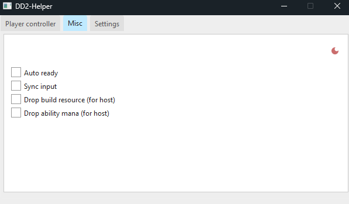
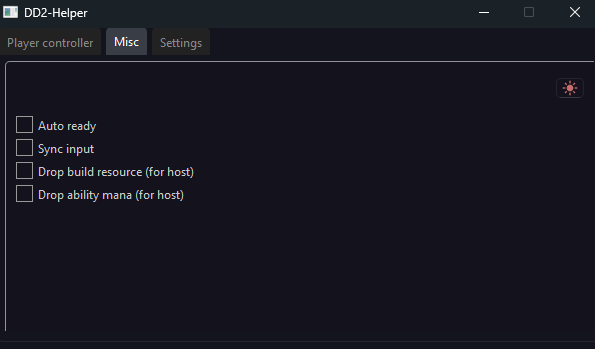

## Preview

## 🚀 How to install
Go to the latest release and download the DD2-Helper and then run the executable file and you're good to go

## 🚀 How to use

Go to the player controller tab and press on the 'update/refresh' icon before that your game should be opened if not then open and refresh it again
and then you can press on combobox and in the dropdown menu you can choose your 'players' host/alts and manipulate them however you want

## 📝 License
This project is licensed under the GNU3 License - see the LICENSE file for details.

## 🤝 Contributing
Contributions are welcome! Please open an issue or pull request.

## 📞 Contact
Email - mez0ry@mail.ru

Discord - Mezory#rand172346 or [discord](https://discord.com/users/277476268209995787)